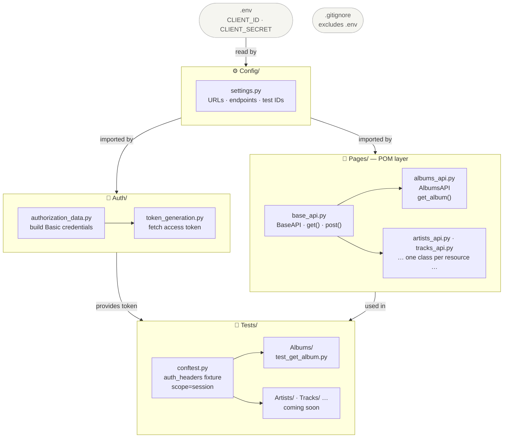

# 🎵 Spotify Web API — Test Automation Suite

A growing API test automation project built with **Python + Pytest + Requests**, structured following the **Page Object Model (POM)** pattern. Tests cover the [Spotify Web API](https://developer.spotify.com/documentation/web-api) and are designed to be readable, maintainable, and easy to extend.

> **Portfolio project** — actively expanding coverage across all available Spotify endpoints.

---

## 📁 Project Structure

```
spotify-api-automation/
│
├── .env                     # Your credentials (not committed — see setup)
├── .env.example             # Template for required environment variables
├── .gitignore
├── README.md
├── requirements.txt
│
├── Config/                  # URLs, endpoints, and test data constants
│   ├── __init__.py
│   └── settings.py
│
├── Auth/                    # Authentication and token management
│   ├── __init__.py
│   ├── authorization_data.py
│   └── token_generation.py
│
├── Pages/                   # POM layer — one class per API resource
│   ├── __init__.py
│   ├── base_api.py          # BaseAPI: shared HTTP methods
│   └── albums_api.py        # AlbumsAPI: /v1/albums/ endpoints
│
└── Tests/                   # Test suites organized by resource
    ├── conftest.py           # Shared fixtures (auth headers)
    └── Albums/
        └── test_get_album.py
```

---

## 🧱 Architecture — Page Object Model

This project adapts the POM pattern for API testing. Each layer has a single responsibility:



| Layer | Responsibility |
|---|---|
| `Config/` | URLs, endpoint paths, test IDs — no logic |
| `Auth/` | Build credentials and retrieve access tokens |
| `Pages/` | Make HTTP calls — one class per API resource |
| `Tests/` | Assert behavior — never touch HTTP directly |

The `BaseAPI` class centralizes shared HTTP logic. Every resource class (e.g. `AlbumsAPI`) inherits from it and only adds its own endpoints.

```python
# Pages/base_api.py
class BaseAPI:
    def __init__(self, headers):
        self.base_url = settings.BASE_URL
        self.headers = headers

    def get(self, endpoint):
        return requests.get(self.base_url + endpoint, headers=self.headers)
```

```python
# Pages/albums_api.py
class AlbumsAPI(BaseAPI):
    def get_album(self, album_id):
        return self.get(settings.GET_ALBUM_URL + album_id)
```

```python
# Tests/Albums/test_get_album.py
def test_get_album_positive(auth_headers):
    api = AlbumsAPI(auth_headers)
    response = api.get_album(settings.ALBUM_ID)
    assert response.status_code == 200
```

---

## ✅ Current Test Coverage

| Resource | Endpoint | Status |
|---|---|---|
| Albums | `GET /v1/albums/{id}` | ✅ Done |
| Artists | `GET /v1/artists/{id}` | 🔜 Coming soon |
| Tracks | `GET /v1/tracks/{id}` | 🔜 Coming soon |
| Search | `GET /v1/search` | 🔜 Coming soon |
| Playlists | `GET /v1/playlists/{id}` | 🔜 Coming soon |

---

## 🚀 Getting Started

### 1. Clone the repository

```bash
git clone https://github.com/your-username/spotify-api-automation.git
cd spotify-api-automation
```

### 2. Install dependencies

```bash
pip install -r requirements.txt
```

### 3. Set up your credentials

Create a `.env` file in the project root based on the provided template:

```bash
cp .env.example .env
```

Open `.env` and fill in your credentials from the [Spotify Developer Dashboard](https://developer.spotify.com/dashboard):

```
CLIENT_ID=your_client_id_here
CLIENT_SECRET=your_client_secret_here
```

> 🔒 The `.env` file is listed in `.gitignore` and will never be committed to the repository.

### 4. Run the tests

```bash
pytest Tests/ -v
```

---

## 🛠️ Tech Stack

- **Python 3.x**
- **Pytest** — test runner and fixtures
- **Requests** — HTTP client
- **python-dotenv** — environment variable management

---

## 📌 Notes

- Authentication uses the [Client Credentials Flow](https://developer.spotify.com/documentation/web-api/tutorials/client-credentials-flow) — no user login required.
- The `auth_headers` fixture in `conftest.py` uses `scope="session"`, so a single token is generated per test run.
- Test IDs (e.g. `ALBUM_ID`) live in `Config/settings.py` and can be changed freely without modifying test logic.